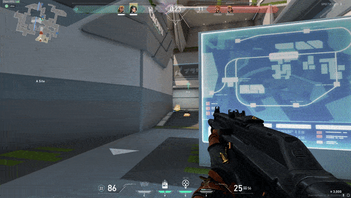

# Project 2

## Week 7

  * Made mounts for IR and fan
  * Bluetooth working
  * Kalman & fuzzy WIP

## Week 8 

  * Code cleanup - changed SIDE_MEASUREMENT to IR_MEASUREMENT
  * Updated get_ir functions, use sams curve fitting
  * prototype fuzzy obstacle detection

# Week 9

  * need new mounts for new PT
  * new long range IR placed at from to detect obstacles behind
  * need to redo rule base, with new sensors